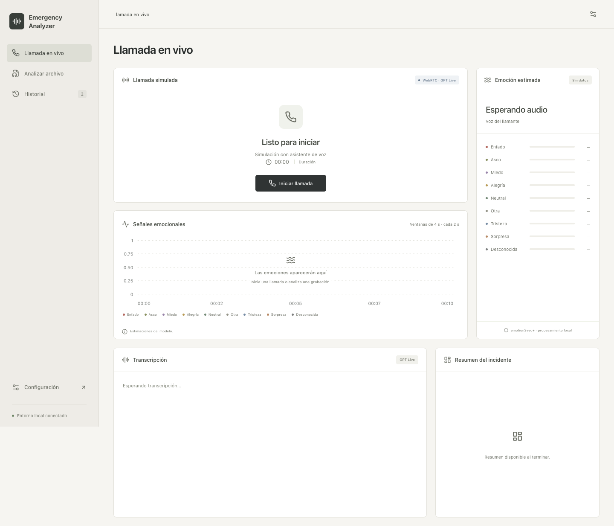
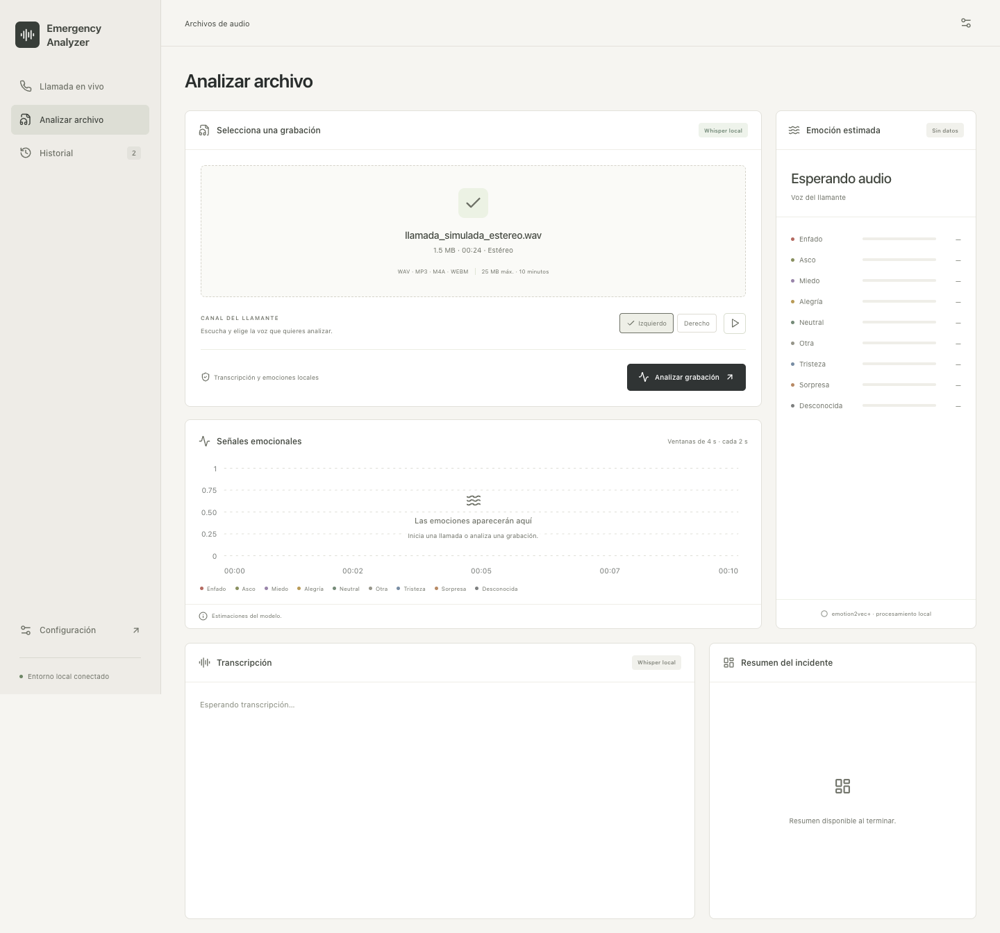
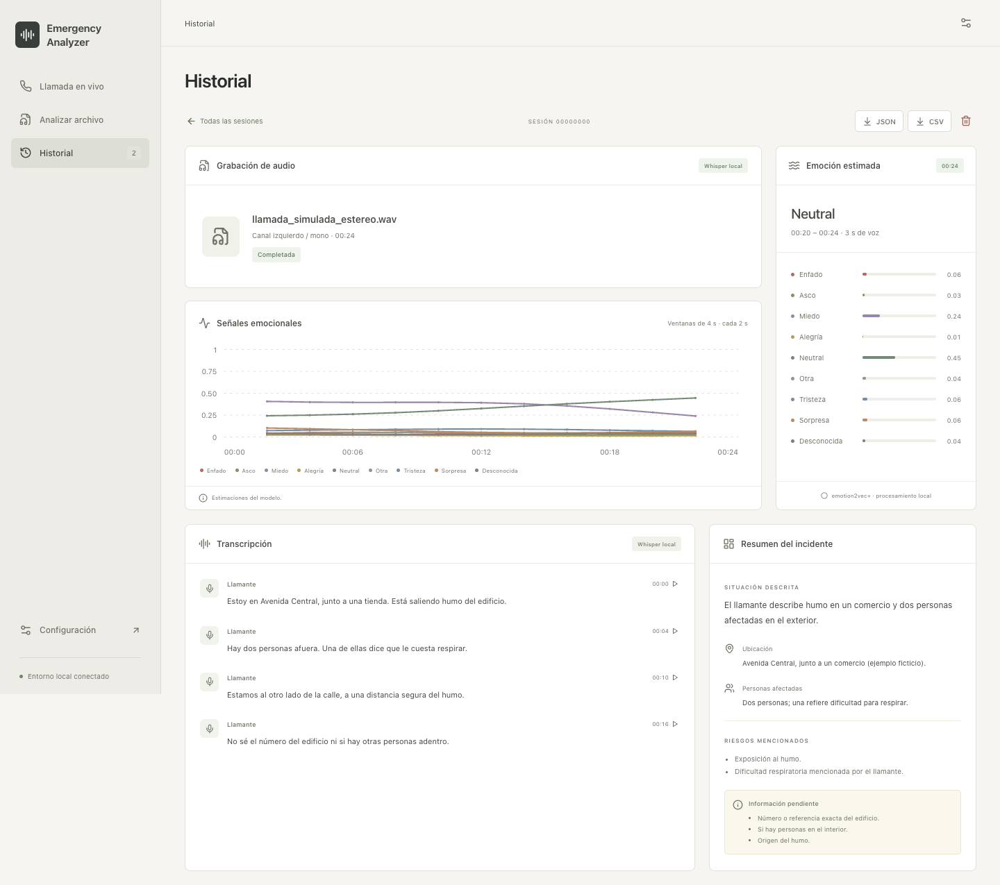

# Emergency Analyzer

Aplicación web local para analizar llamadas de emergencia simuladas y archivos de audio mediante transcripción, reconocimiento de emociones y resúmenes estructurados. La interfaz está disponible en español de México.

El proyecto está orientado a investigación y revisión humana. No verifica la veracidad de las llamadas ni despacha servicios de emergencia.

## Capturas de pantalla

Capturas de la interfaz con datos simulados. Las conversaciones, puntuaciones emocionales y resúmenes son ejemplos ilustrativos.

### Llamada simulada

Consola para iniciar una llamada y observar la transcripción y las señales emocionales.



### Preparar un archivo de audio

Vista previa de una grabación estéreo y selección del canal del llamante antes del análisis local.



### Resultados del análisis

Ejemplo de una sesión guardada con transcripción, evolución de las puntuaciones emocionales y resumen del incidente.



## Requisitos

**Plataformas:** Windows, Linux y macOS. El entorno validado es macOS ARM64 con Python 3.11. La validación completa en Windows y Linux está pendiente.

| Componente | Requisito |
| --- | --- |
| Python | **3.11**, con `pip` y `venv` |
| Node.js | **22.20+** en la serie 22, **24.12+** en la serie 24, o 25+, con npm |
| FFmpeg | `ffmpeg` y `ffprobe` disponibles en `PATH` |
| Navegador | Chrome, con permiso de micrófono para llamadas |
| Git | Para clonar el repositorio |
| OpenAI | API key y acceso a los modelos configurados, para llamadas y resúmenes |

Whisper y emotion2vec+ se ejecutan en **CPU**. La instalación descarga las dependencias; los pesos se descargan durante la preparación de los modelos o en su primer uso. Los pesos requieren aproximadamente 1.6 GB de almacenamiento, además del entorno Python, las dependencias y las grabaciones. El tiempo de procesamiento depende del equipo.

### Instalar las herramientas del sistema

- **Windows:** instala Python 3.11 y su launcher `py`, Node.js y Git. Descarga una compilación de FFmpeg desde los enlaces de [FFmpeg para Windows](https://ffmpeg.org/download.html), extrae el paquete y añade su carpeta `bin` a `PATH`. Debe contener tanto `ffmpeg.exe` como `ffprobe.exe`. Abre una nueva terminal después de cambiar `PATH`.
- **Linux:** instala Python 3.11 y su soporte para `venv`, Node.js, Git y FFmpeg con las herramientas de tu distribución. En Ubuntu/Debian puedes instalar FFmpeg con los comandos siguientes; la disponibilidad de Python 3.11 depende de la versión de la distribución. En otras distribuciones, usa su gestor de paquetes.
- **macOS:** puedes instalar las herramientas con [Homebrew](https://brew.sh/) usando el comando siguiente, o sus instaladores correspondientes.

Linux, Ubuntu/Debian:

```bash
sudo apt update
sudo apt install ffmpeg
```

macOS, con Homebrew:

```bash
brew install python@3.11 node git ffmpeg
```

Descargas y documentación: [Python](https://www.python.org/downloads/), [Node.js](https://nodejs.org/en/download), [Git](https://git-scm.com/downloads) y [FFmpeg](https://ffmpeg.org/download.html). Los ejemplos de instalación de FFmpeg también están en la [documentación de Whisper](https://github.com/openai/whisper#setup).

Comprueba las herramientas desde la terminal que utilizarás para ejecutar la aplicación:

```text
git --version
node --version
ffmpeg -version
ffprobe -version
```

Para Python, usa `py -3.11 --version` en Windows o `python3.11 --version` en Linux/macOS. Si tu instalación utiliza otro nombre, verifica que ese ejecutable sea Python 3.11 y úsalo al crear el entorno.

## Instalación

Clona el repositorio:

```text
git clone https://github.com/jrterven/emergency-call-analyzer.git
cd emergency-call-analyzer
```

Ejecuta los comandos desde la **raíz del repositorio**. Los ejemplos usan directamente el intérprete de `.venv`; no requieren activar el entorno. Las rutas del entorno virtual dependen del sistema operativo, como describe la [documentación de Python](https://docs.python.org/3.11/library/venv.html#how-venvs-work).

### Windows — PowerShell

```powershell
py -3.11 -m venv .venv
.\.venv\Scripts\python.exe -m pip install --upgrade pip
.\.venv\Scripts\python.exe -m pip install --cache-dir .model-cache/pip -r requirements-ml.txt
npm.cmd --prefix frontend ci
if (!(Test-Path .env)) { Copy-Item .env.example .env }
```

Se usa `npm.cmd` para evitar que PowerShell intente ejecutar `npm.ps1`. Si no tienes el launcher `py`, sustituye el primer comando por `python -m venv .venv` después de comprobar que `python --version` indica 3.11.

### Linux y macOS — Bash o Zsh

```bash
python3.11 -m venv .venv
.venv/bin/python -m pip install --upgrade pip
.venv/bin/python -m pip install --cache-dir .model-cache/pip -r requirements-ml.txt
npm --prefix frontend ci
if [ ! -f .env ]; then cp .env.example .env; fi
```

En estos sistemas también puedes usar `./scripts/setup.sh`, que prepara el entorno, instala las dependencias y crea `.env` si aún no existe. Si Python 3.11 tiene otro nombre, ejecuta `PYTHON_BIN=python3 ./scripts/setup.sh`, verificando antes su versión. Los scripts `.sh` requieren Bash; en Windows utiliza los comandos de PowerShell anteriores.

`requirements-ml.txt` contiene las dependencias del backend y de los modelos locales. `requirements-lock.txt` registra el entorno validado en macOS ARM64 e incluye dependencias específicas de esa plataforma; no es un archivo de instalación multiplataforma.

### Configurar OpenAI

Edita el archivo `.env` creado en la raíz y añade tu propia clave a `OPENAI_API_KEY`. Sin clave puedes analizar archivos localmente; las llamadas y los resúmenes requieren conexión a OpenAI y pueden generar costes.

Una variable `OPENAI_API_KEY` ya definida en el entorno tiene prioridad sobre `.env`. La clave se utiliza exclusivamente en el backend. `.env` está excluido de Git; el repositorio incluye únicamente `.env.example`, con la clave vacía. Reinicia el backend después de cambiar la configuración.

## Ejecución

### Inicio con Bash

En Linux, macOS o una instalación Linux dentro de WSL, ejecuta desde la raíz:

```bash
bash start.sh
```

El script prepara el entorno y las dependencias del proyecto si faltan, crea `.env` si no existe, activa `.venv` e inicia el backend y el frontend. Python 3.11, Node.js/npm y FFmpeg deben estar instalados previamente según la sección de requisitos. La primera preparación necesita Internet; los siguientes arranques reutilizan el entorno instalado. Los pesos de los modelos se descargan al prepararlos o usarlos por primera vez.

Cuando aparezca **Emergency Analyzer listo**, abre [http://127.0.0.1:5173](http://127.0.0.1:5173). `Ctrl+C` detiene ambos servicios y sus procesos hijos. El script detiene el servicio restante si uno falla y comprueba la disponibilidad de los puertos antes del arranque. La configuración y el historial existentes se conservan.

También puedes invocar el script desde otro directorio usando su ruta completa. Si necesitas otro ejecutable de Python 3.11 durante la preparación inicial, usa `PYTHON_BIN=python3 bash start.sh` tras verificar su versión. En Windows nativo, utiliza el arranque manual de PowerShell siguiente.

### Detención con Bash

En Linux, macOS o WSL, ejecuta desde la raíz, incluso desde otra terminal:

```bash
bash stop.sh
```

El script detiene el backend, el frontend y sus procesos hijos, incluidos los que permanezcan activos tras el cierre inesperado de la terminal. Reconoce los servicios iniciados con `start.sh`, `dev.sh` y los comandos de arranque manual de esta guía. El plazo de cierre es de 10 segundos; los procesos que no respondan se terminan de forma forzada. Si no hay servicios activos, el script finaliza correctamente.

`start.sh` registra los procesos en `.run/services.json`, excluido de Git. El cierre comprueba la identidad y el directorio de los procesos para evitar terminar otros programas de Python o Node. Conserva `.env`, los modelos y el historial. Para guardar la grabación completa de una llamada activa, termina primero la llamada en la interfaz.

Puedes ejecutar `bash /ruta/al/repositorio/stop.sh` desde otro directorio. El script usa el Python de `.venv` si existe; en caso contrario, `python3` o el ejecutable indicado con `PYTHON_BIN`. En Windows nativo con PowerShell, detén cada servicio con `Ctrl+C` en su terminal; los scripts Bash se usan dentro de WSL.

### Arranque manual

Como alternativa, abre **dos terminales**, ambas en la raíz del repositorio.

#### Windows — PowerShell

Terminal 1, backend:

```powershell
.\.venv\Scripts\python.exe -m uvicorn backend.main:app --host 127.0.0.1 --port 8000 --reload --reload-dir backend
```

Terminal 2, frontend:

```powershell
npm.cmd --prefix frontend run dev -- --host 127.0.0.1 --port 5173 --strictPort
```

#### Linux y macOS — Bash o Zsh

Terminal 1, backend:

```bash
.venv/bin/python -m uvicorn backend.main:app --host 127.0.0.1 --port 8000 --reload --reload-dir backend
```

Terminal 2, frontend:

```bash
npm --prefix frontend run dev -- --host 127.0.0.1 --port 5173 --strictPort
```

Si el entorno ya está preparado, `bash scripts/dev.sh` también activa `.venv` e inicia ambos servidores desde una terminal.

Abre [http://127.0.0.1:5173](http://127.0.0.1:5173) en Chrome y permite el acceso al micrófono para las llamadas. La pantalla de configuración muestra el estado de la clave de API, FFmpeg y los modelos locales. Con el arranque manual, cada servidor se detiene con `Ctrl+C` en su terminal; con `dev.sh`, `Ctrl+C` detiene ambos.

Usa un único proceso backend: la reserva de una sesión activa se mantiene en memoria. Los comandos de esta guía usan el servidor de desarrollo de Vite; `npm run build` verifica y genera el frontend, pero no inicia el backend.

### Preparar los modelos locales

Puedes descargar e inicializar los pesos antes de la primera sesión:

Windows, PowerShell:

```powershell
.\.venv\Scripts\python.exe scripts/download_models.py
```

Linux/macOS:

```bash
.venv/bin/python scripts/download_models.py
```

Los pesos se guardan en `.model-cache/` y se reutilizan. Tras descargarlos, la transcripción y las emociones de archivos pueden ejecutarse sin conexión; las llamadas y los resúmenes siguen necesitando OpenAI. El primer análisis puede tardar más por las descargas y la inicialización.

El script prepara los modelos en un proceso separado del backend. La carga en memoria del backend ocurre durante el primer análisis y reutiliza los pesos descargados.

## Interfaz

La interfaz incluye:

- Controles para iniciar, silenciar y finalizar llamadas, con temporizador y nivel del micrófono.
- Carga de archivos con vista previa y selección del canal del llamante.
- Transcripción con identificación de participantes y navegación por la grabación.
- Gráficas de puntuaciones emocionales y resumen de la sesión.
- Historial con reproducción de audio, exportación y eliminación de sesiones.

La reproducción está disponible una vez guardado el audio, incluso si el análisis continúa. Las llamadas conservan una grabación estéreo; las sesiones recuperadas sin esa grabación pueden ofrecer únicamente el audio del llamante.

## Modos de uso

- **Llamada en vivo:** WebRTC conecta el micrófono con `gpt-live-1`. GPT-Live proporciona las transcripciones de ambos participantes. Un AudioWorklet independiente envía únicamente el micrófono al análisis emocional local. La grabación estéreo conserva al llamante a la izquierda y al asistente a la derecha.
- **Archivos:** WAV, MP3, M4A o WebM, hasta 25 MB y 10 minutos. Primero escucha y selecciona el canal del llamante; FFmpeg extrae ese canal antes de convertirlo a mono de 16 kHz. La misma señal, con silencios intactos, alimenta emotion2vec+ y Whisper local. Las conversaciones mezcladas en un solo canal requieren preparar previamente una voz aislada.

El asistente recopila la ubicación, la descripción del incidente, las personas afectadas y los riesgos inmediatos. Los prompts se definen en [backend/prompts.py](backend/prompts.py) y su versión se incluye en las exportaciones de las sesiones.

Los trabajos locales se ejecutan de uno en uno, fuera del servidor HTTP. En archivos se calculan las emociones antes de transcribir. En vivo se usan ventanas de 4 segundos cada 2 segundos; una ventana necesita al menos un segundo de voz. Si el modelo se retrasa, se registra la ventana omitida y se prioriza la reciente. El audio completo del llamante se conserva independientemente de esas omisiones.

Whisper es el paquete local `openai-whisper`, modelo multilingüe `small`, CPU y FP32. No hay fallback a una API de transcripción. Sus segmentos tienen tiempos estimados. Los fragmentos de GPT-Live mantienen sus tiempos originales; el reloj de la grabación y el de la sesión tienen un desplazamiento aproximado registrado en la configuración.

## Almacenamiento y uso de API

La transcripción y el reconocimiento emocional de **archivos** se ejecutan en el equipo del backend. El resumen usa `gpt-6-luna` y envía únicamente la transcripción. Las llamadas en vivo envían audio a OpenAI y usan un backend delegado; ambas capacidades generan consumo de API. Sin una clave de API, el análisis local de archivos está disponible y el resumen queda pendiente.

El historial se guarda en `data/sessions.sqlite3`, y cada sesión tiene su directorio de audio. Se conserva hasta eliminarlo desde la interfaz. JSON exporta resultados, prompts, parámetros, modelos y revisiones; CSV exporta las ventanas emocionales. Al reiniciar se marcan como parciales las sesiones inconclusas. Si falla una etapa, se conservan los datos ya disponibles.

La aplicación admite una sesión activa a la vez y se ejecuta en localhost. Los comandos de arranque enlazan ambos servidores a `127.0.0.1`; el backend valida los orígenes de HTTP/WebSocket. No incluye integración con telefonía real.

`.env`, `data/`, `.model-cache/`, `.venv/`, `.run/`, las dependencias del frontend y los resultados de pruebas están excluidos de Git. Cada instalación conserva sus propias credenciales, modelos e historial.

## Configuración

Las opciones de configuración se definen en [.env.example](.env.example):

| Variable | Valor inicial |
| --- | --- |
| `WHISPER_MODEL` | `small` |
| `EMOTION_MODEL` | `emotion2vec/emotion2vec_plus_base` |
| `EMOTION_MODEL_REVISION` | `main`; el hash resuelto se exporta |
| `LIVE_MODEL` | `gpt-live-1` |
| `SUMMARY_MODEL` | `gpt-6-luna` |
| `TORCH_NUM_THREADS` | `4` |
| `MODEL_CACHE_DIR` | `.model-cache` |
| `DATA_DIR` | `data` |
| `FFMPEG_BINARY` | `ffmpeg`, buscado en `PATH` |
| `FFPROBE_BINARY` | `ffprobe`, buscado en `PATH` |

Ejecuta siempre el backend desde la raíz: las rutas relativas de `DATA_DIR` y `MODEL_CACHE_DIR` se resuelven desde el directorio de trabajo. También puedes usar rutas absolutas propias de tu sistema; en Windows utiliza barras `/` en `.env`, por ejemplo `DATA_DIR=C:/emergency-analyzer/data`.

Si necesitas indicar los ejecutables de FFmpeg mediante rutas completas, define `FFMPEG_BINARY` y `FFPROBE_BINARY` en `.env`. El script `setup.sh` y las pruebas requieren además encontrarlos por nombre en `PATH`.

La carga del modelo es diferida; la pantalla de configuración indica cuándo está cargado. Las licencias de código y pesos son independientes; emotion2vec+ conserva la referencia a la licencia de modelos de FunASR en su ficha oficial.

## Solución de problemas

| Problema | Qué comprobar |
| --- | --- |
| Python no encontrado | Verifica `py -3.11 --version` en Windows o `python3.11 --version` en Linux/macOS. Instala Python 3.11 o usa la ruta de su ejecutable. |
| No se puede crear `.venv` en Linux | Instala el paquete de soporte `venv` para tu Python 3.11, según tu distribución. |
| FFmpeg no disponible | Ambos comandos, `ffmpeg -version` y `ffprobe -version`, deben funcionar en la terminal del backend. Tras cambiar `PATH`, abre una nueva terminal y reinicia el backend. |
| PowerShell bloquea `npm.ps1` | Usa los comandos `npm.cmd` de esta guía y `npx.cmd` para la prueba de navegador. |
| Falla la instalación de PyTorch | Comprueba que tu sistema y arquitectura tengan paquetes compatibles. Consulta el [selector oficial de PyTorch](https://pytorch.org/get-started/locally/) para CPU y mantén `torch` y `torchaudio` compatibles entre sí y con los rangos de `requirements-ml.txt`. |
| Falla la instalación de Whisper/tiktoken | Actualiza `pip`. Si el error indica que necesita compilar tiktoken, consulta los requisitos de Rust en la [instalación oficial de Whisper](https://github.com/openai/whisper#setup). |
| La app no conecta con el backend | Comprueba que ambas terminales sigan activas, que los puertos 8000 y 5173 estén libres y que uses la URL indicada. Vite reenvía `/api` al backend en 8000. |
| No funciona el micrófono | Comprueba los permisos del sitio en Chrome y los del micrófono en Windows, Linux o macOS. Usa la dirección local indicada. |
| Falla la descarga de modelos | Comprueba conexión, espacio libre y permisos sobre `.model-cache/`; vuelve a ejecutar `scripts/download_models.py` con el Python de `.venv`. |
| No se puede iniciar Live o generar un resumen | Comprueba la API key, el acceso a los modelos configurados y el mensaje de error. Los resultados locales ya obtenidos se conservan. |

## Pruebas

Windows, PowerShell:

```powershell
.\.venv\Scripts\python.exe -m pytest -q
npm.cmd --prefix frontend run build
```

Linux/macOS:

```bash
.venv/bin/python -m pytest -q
npm --prefix frontend run build
```

Las pruebas usan directorios temporales y verifican canales, frecuencias de muestreo, silencio, persistencia, cierres parciales y límites. No requieren llamadas facturadas ni descargar modelos. Para ejecutar todas las pruebas de audio, instala FFmpeg con `ffprobe` y soporte para `libopus`. Las pruebas con modelos reales se realizan por separado usando audio sintético en español.

Las pruebas del control de servicios cubren la identificación de procesos del repositorio, la reutilización de PID, los procesos huérfanos y los permisos del registro local. La validación del arranque y cierre con Bash se realizó en macOS; los flujos de Linux y WSL están pendientes de validación.

Con la aplicación en ejecución, las pruebas de navegador verifican la transcripción, el desplazamiento y la reproducción de audio en Chrome:

```bash
npx --package @playwright/cli playwright-cli -s=ui-check open http://127.0.0.1:5173/
npx --package @playwright/cli playwright-cli -s=ui-check run-code --filename=tests/ui_regression.js
npx --package @playwright/cli playwright-cli -s=ui-check run-code --filename=tests/playback_regression.js
npx --package @playwright/cli playwright-cli -s=ui-check close
```

`ui_regression.js` cubre actualizaciones atrasadas, fragmentos repetidos y desplazamiento manual de la transcripción. `playback_regression.js` verifica la carga de la grabación final, la presencia de señal audible y la estabilidad del reproductor durante las actualizaciones de la sesión. Ambas pruebas simulan las respuestas de la API y usan datos sintéticos; no acceden al micrófono, OpenAI ni al historial local.

En PowerShell sustituye `npx` por `npx.cmd`. Estas pruebas requieren Chrome instalado y la aplicación en ejecución. La validación de los modelos y la captura de audio en cada sistema operativo es independiente de estas pruebas.

La calidad en llamadas reales, acentos, ruido y voces superpuestas requiere evaluación con anotaciones humanas. Los resultados de este prototipo son estimaciones para investigación.

## API local

- `GET /api/health`, `GET /api/sessions`, `GET /api/sessions/{id}`.
- `POST /api/sessions` con `source: live | file`; reserva el único trabajo activo.
- `POST /api/sessions/{id}/connect` con oferta SDP para GPT-Live.
- `POST /api/sessions/{id}/upload` con archivo y canal; procesamiento asíncrono.
- `POST /api/sessions/{id}/recording` y `/finish` para guardar/cerrar llamadas.
- `POST /api/sessions/{id}/summary` para reintentar un resumen.
- `GET /api/sessions/{id}/audio`, `/export?format=json|csv`, `DELETE /api/sessions/{id}`.
- `WS /api/sessions/{id}/stream`: configuración de frecuencia, PCM16 mono, fragmentos de transcripción y actualizaciones emocionales.

Swagger está disponible en [http://127.0.0.1:8000/docs](http://127.0.0.1:8000/docs).

## Referencias

- [GPT-Live](https://developers.openai.com/api/docs/guides/live)
- [Whisper](https://github.com/openai/whisper)
- [emotion2vec+ base](https://huggingface.co/emotion2vec/emotion2vec_plus_base)
